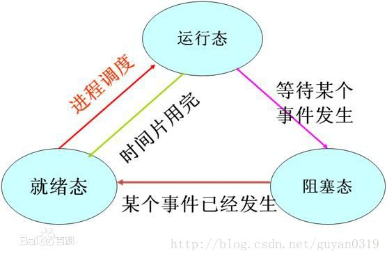

<!-- TOC -->

- [1. C# 协程原理分析](#1-c-%e5%8d%8f%e7%a8%8b%e5%8e%9f%e7%90%86%e5%88%86%e6%9e%90)
  - [1.1 进程、线程、协程区别](#11-%e8%bf%9b%e7%a8%8b%e7%ba%bf%e7%a8%8b%e5%8d%8f%e7%a8%8b%e5%8c%ba%e5%88%ab)
    - [1.1.1 进程](#111-%e8%bf%9b%e7%a8%8b)
    - [1.1.2 线程](#112-%e7%ba%bf%e7%a8%8b)
    - [1.1.3 协程](#113-%e5%8d%8f%e7%a8%8b)
  - [1.2 yeild 关键字](#12-yeild-%e5%85%b3%e9%94%ae%e5%ad%97)
  - [1.3 代码分析](#13-%e4%bb%a3%e7%a0%81%e5%88%86%e6%9e%90)
    - [1.3.1 接口 IWait](#131-%e6%8e%a5%e5%8f%a3-iwait)
    - [1.3.2 类 WaitForFrames](#132-%e7%b1%bb-waitforframes)
    - [1.3.3 类 WaitForSeconds](#133-%e7%b1%bb-waitforseconds)
    - [1.3.4 类 WaitForSeconds](#134-%e7%b1%bb-waitforseconds)
- [参考文章](#%e5%8f%82%e8%80%83%e6%96%87%e7%ab%a0)

<!-- /TOC -->

# 1. C# 协程原理分析

进程、线程、协程 都是程序中用来处理事务的机制。协程属于编程语言支持的一种运行方式。


## 1.1 进程、线程、协程区别

* 进程：程序运行的实体，所有资源独立。
* 线程：构成进程的基本单元，共享进程的内存，私有自己内存空间。
* 协程：利用yeild分步调用函数。

### 1.1.1 进程

> 进程（Process）是计算机中的程序关于某数据集合上的一次运行活动，是系统进行资源分配和调度的基本单位，是操作系统结构的基础。在早期面向进程设计的计算机结构中，进程是程序的基本执行实体；在当代面向线程设计的计算机结构中，进程是线程的容器。程序是指令、数据及其组织形式的描述，进程是程序的实体。

* **组成**  
进程是一个实体。每一个进程都有它自己的地址空间，一般情况下，包括文本区域（text region）、数据区域（data region）和堆栈（stack region）。文本区域存储处理器执行的代码；数据区域存储变量和进程执行期间使用的动态分配的内存；堆栈区域存储着活动过程调用的指令和本地变量。

* **特征**  
动态性：进程的实质是程序在多道程序系统中的一次执行过程，进程是动态产生，动态消亡的。 
并发性：任何进程都可以同其他进程一起并发执行 
独立性：进程是一个能独立运行的基本单位，同时也是系统分配资源和调度的独立单位； 
异步性：由于进程间的相互制约，使进程具有执行的间断性，即进程按各自独立的、不可预知的速度向前推进 
结构特征：进程由程序、数据和进程控制块三部分组成。 
多个不同的进程可以包含相同的程序：一个程序在不同的数据集里就构成不同的进程，能得到不同的结果；但是执行过程中，程序不能发生改变。



### 1.1.2 线程

> 线程，有时被称为轻量级进程(Lightweight Process，LWP），是程序执行流的最小单元。一个标准的线程由线程ID，> 当前指令指针(PC），寄存器集合和堆栈组成。另外，线程是进程中的一个实体，是被系统独立调度和分派的基本单位，> 线程自己不拥有系统资源，只拥有一点儿在运行中必不可少的资源，但它可与同属一个进程的其它线程共享进程所拥有> 的全部资源。
> 
> 线程是程序中一个单一的顺序控制流程。进程内有一个相对独立的、可调度的执行单元，是系统独立调度和分派CPU的基> 本单位指令运行时的程序的调度单位。在单个程序中同时运行多个线程完成不同的工作，称为多线程。

* **轻型实体**  
线程中的实体基本上不拥有系统资源，只是有一点必不可少的、能保证独立运行的资源。 
线程的实体包括程序、数据和TCB。线程是动态概念，它的动态特性由线程控制块TCB（Thread Control Block）描述。TCB包括以下信息：  
   + 线程状态。  
   + 当线程不运行时，被保存的现场资源。  
   + 一组执行堆栈。  
   + 存放每个线程的局部变量主存区。  
   + 访问同一个进程中的主存和其它资源。用于指示被执行指令序列的程序计数器、保留局部变量、少数状态参数和返回地址等的一组寄存器和堆栈。 

* **独立调度和分派的基本单位**  
在多线程OS中，线程是能独立运行的基本单位，因而也是独立调度和分派的基本单位。由于线程很“轻”，故线程的切换非常迅速且开销小（在同一进程中的）。 

* **可并发执行**  
在一个进程中的多个线程之间，可以并发执行，甚至允许在一个进程中所有线程都能并发执行；同样，不同进程中的线程也能并发执行，充分利用和发挥了处理机与外围设备并行工作的能力。 

* **共享进程资源**  
在同一进程中的各个线程，都可以共享该进程所拥有的资源，这首先表现在：所有线程都具有相同的地址空间（进程的地址空间），这意味着，线程可以访问该地址空间的每一个虚地址；此外，还可以访问进程所拥有的已打开文件、定时器、信号量机构等。由于同一个进程内的线程共享内存和文件，所以线程之间互相通信不必调用内核。

### 1.1.3 协程

> 协程与子例程一样，协程（coroutine）也是一种程序组件。相对子例程而言，协程更为一般和灵活，但在实践中使用没有子例程那样广泛。协程源自 Simula 和 Modula-2 语言，但也有其他语言支持。 
协程不是进程或线程，其执行过程更类似于子例程，或者说不带返回值的函数调用。 
一个程序可以包含多个协程，可以对比与一个进程包含多个线程， 
因而下面我们来比较协程和线程。我们知道多个线程相对独立，有自己的上下文，切换受系统控制；而协程也相对独立，有自己的上下文，但是其切换由自己控制，由当前协程切换到其他协程由当前协程来控制。 
协程和线程区别：协程避免了无意义的调度，由此可以提高性能，但也因此，程序员必须自己承担调度的责任，同时，协程也失去了标准线程使用多CPU的能力。

## 1.2 yeild 关键字

> 迭代器方法运行到 yield return 语句时，会返回一个 expression，并保留当前在代码中的位置。 下次调用迭代器函数时，将从该位置重新开始执行。

需要补充，[解释链接](https://www.cnblogs.com/blueberryzzz/p/8667261.html)

## 1.3 代码分析


### 1.3.1 接口 IWait
```
    /// <summary>
    /// 等待接口
    /// </summary>
    interface IWait
    {
        /// <summary>
        /// 每帧检测是否等待结束
        /// </summary>
        /// <returns>是否完成</returns>
        bool Tick();
    }
```

### 1.3.2 类 WaitForFrames
```
/// <summary>
/// 按帧等待
/// </summary>
public class WaitForFrames : IWait
{
    private int frames = 0;
    public WaitForFrames(int frames)
    {
        this.frames = frames;
    }

    public bool Tick()
    {
        --this.frames;
        return this.frames <= 0;
    }
}
```

### 1.3.3 类 WaitForSeconds

```
/// <summary>
/// 按秒等待
/// </summary>
public class WaitForSeconds : IWait
{
    int milliseconds = 0;
    DateTime begin;

    public WaitForSeconds(float seconds)
    {
        this.begin = DateTime.Now;
        this.milliseconds = (int)(seconds * 1000);
    }

    public bool Tick()
    {
        TimeSpan span = DateTime.Now - begin;
        return span.TotalMilliseconds >= milliseconds;
    }
}
```

### 1.3.4 类 WaitForSeconds
```
public class CoroutineManager
{
    private static CoroutineManager instance = null;
    public static CoroutineManager Instance
    {
        get
        {
            if (instance == null)
            {
                instance = new CoroutineManager();
            }
            return instance;
        }
    }

    private LinkedList<IEnumerator> coroutineList = new LinkedList<IEnumerator>();
    public void StartCoroutine(IEnumerator ie)
    {
        coroutineList.AddLast(ie);
    }

    public void StopCoroutine(IEnumerator ie)
    {
        try
        {
            coroutineList.Remove(ie);
        }
        catch (Exception e) { Console.WriteLine(e.ToString()); }
    }

    public void Update()
    {
        var node = coroutineList.First;
        while (node != null)
        {
            IEnumerator ie = node.Value;
            bool ret = true;
            if (ie.Current is IWait)
            {
                IWait wait = (IWait)ie.Current;
                //检测等待条件，条件满足，跳到迭代器的下一元素 （IEnumerator方法里的下一个yield）
                if (wait.Tick())
                {
                    ret = ie.MoveNext();
                }
            }
            else
            {
                ret = ie.MoveNext();
            }
            //迭代器没有下一个元素了，删除迭代器（IEnumerator方法执行结束）
            if (!ret)
            {
                coroutineList.Remove(node);
            }
            //下一个迭代器
            node = node.Next;
        }
    }
}
```

# 参考文章  
- [Guo磊进程、线程和协程的理解](https://www.cnblogs.com/guolei2570/p/8810536.html)  
- [用C# 模拟实现unity里的协程](https://www.cnblogs.com/yougoo/p/9565704.html)
- [yield 解释](https://www.cnblogs.com/blueberryzzz/p/8667261.html)