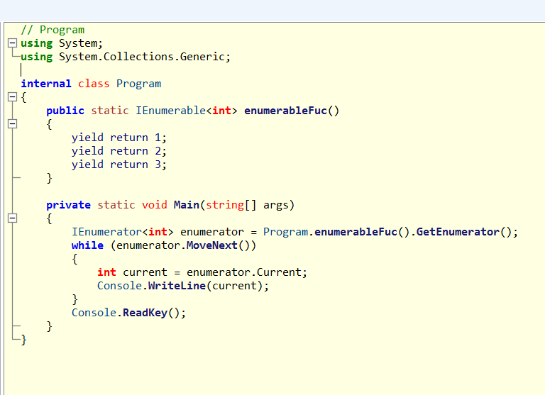
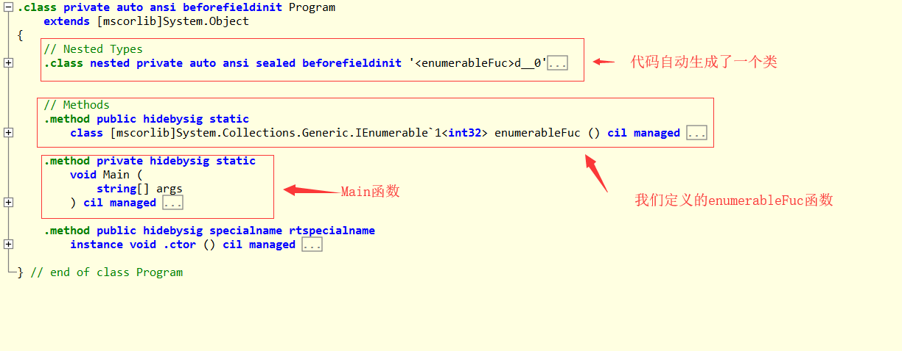
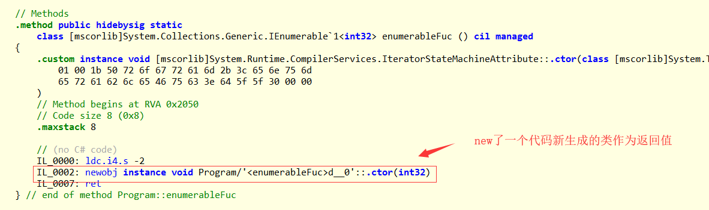
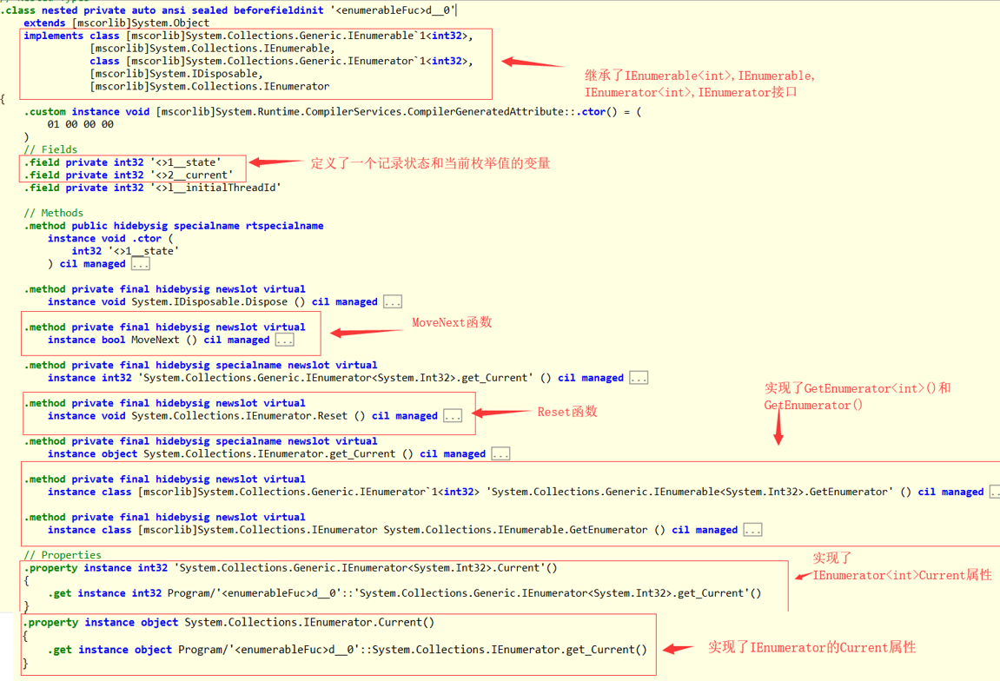
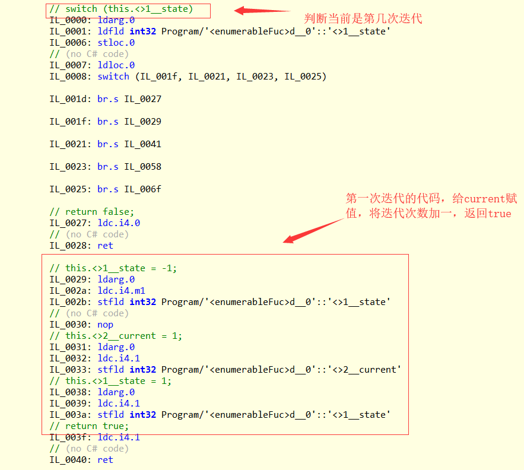
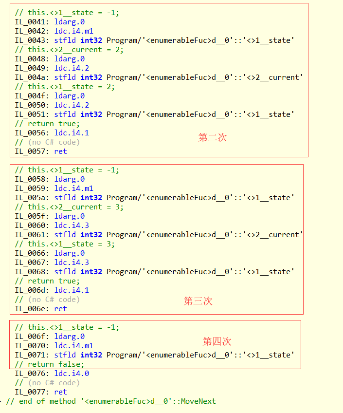

# c# yield关键字的用法
[原文地址](https://www.cnblogs.com/blueberryzzz/p/8678700.html)
## 1.yield实现的功能
### yield return：
先看下面的代码，通过yield return实现了类似用foreach遍历数组的功能，说明yield return也是用来实现迭代器的功能的。
```cs
using static System.Console;
using System.Collections.Generic;

class Program
{
    //一个返回类型为IEnumerable<int>，其中包含三个yield return
    public static IEnumerable<int> enumerableFuc()
    {
        yield return 1;
        yield return 2;
        yield return 3;
    }

    static void Main(string[] args)
    {
        //通过foreach循环迭代此函数
        foreach(int item in enumerableFuc())
        {
            WriteLine(item);
        }
        ReadKey();
    }
}

输出结果：
1
2
3
```

### yield break:
再看下面的代码，只输出了1，2，没有输出3，说明这个迭代器被yield break停掉了，所以yield break是用来终止迭代的。
```cs
using static System.Console;
using System.Collections.Generic;
class Program
{
    //一个返回类型为IEnumerable<int>，其中包含三个yield return
    public static IEnumerable<int> enumerableFuc()
    {
        yield return 1;
        yield return 2;
        yield break;
        yield return 3;
    }

    static void Main(string[] args)
    {
        //通过foreach循环迭代此函数
        foreach(int item in enumerableFuc())
        {
            WriteLine(item);
        }
        ReadKey();
    }
}

输出结果：
1
2
```

## 2.只能使用在返回类型必须为 IEnumerable、IEnumerable<T>、IEnumerator 或 IEnumerator<T>的方法、运算符、get访问器中。

## 3.yield关键字的实现原理
我们用while循环代替foreach循环，发现我们虽然没有实现GetEnumerator()，也没有实现对应的IEnumerator的MoveNext()，和Current属性，但是我们仍然能正常使用这些函数。

```cs
class Program
{
    //一个返回类型为IEnumerable<int>，其中包含三个yield return
    public static IEnumerable<int> enumerableFuc()
    {
        yield return 1;
        yield return 2;
        yield return 3;
    }

    static void Main(string[] args)
    {
        //用while循环代替foreach
        IEnumerator<int> enumerator = enumerableFuc().GetEnumerator();
        while (enumerator.MoveNext())
        {
            int current = enumerator.Current;
            WriteLine(current);
        }
        ReadKey();
    }
}

输出结果：
1
2
3
```

至于为什么会出现这种情况，我们可以用ILSpy对生成的exe进行反编译来找到原因。
由于直接反编译成C#会变为原样  


所以我们选择反编译为带C#注释的IL代码，虽然可读性差点，但是可以详细的了解其中过的原理。


先来看Program翻译的情况，编译的时候自动生成了一个新的类。   


接下来我们来仔细看这些代码，EnumerableFuc()返回了这个新的类。  


看这个代码自动生成的类的实现，发现它继承了IEnumerable、IEnumerable<T>、IEnumerator 或 IEnumerator<T>，这时我们应该已经能猜到这个新的类就是我们没有实现对应的IEnumerator的MoveNext()，和Current属性，但是我们仍然能正常使用这些函数的原因了。  



我们再来看一下这个类具体是如何实现迭代的呢，我们主要来看一下MoveNext()函数





每次调用MoveNext()函数都会将state加1，一共进行了4次迭代，前三次返回true，最后一次返回false，代表迭代结束。这四次迭代对应被3个yield return语句分成4部分的enumberableFuc()中的语句。

**用enumberableFuc()来进行迭代的真实流程就是：**


1. 运行enumberableFuc()函数，获取代码自动生成的类的实例。
2. 接着调用GetEnumberator()函数，将获取的类自己作为迭代器开始迭代。
3. 每次运行MoveNext()，state增加1，通过switch语句可以让每次调用MoveNext()的时候执行不同部分的代码。
4. MoveNext()返回false，结束。

**这也能说明yield关键字其实是一种语法糖，最终还是通过实现IEnumberable<T>、IEnumberable、IEnumberator<T>和IEnumberator接口实现的迭代功能。**