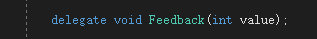
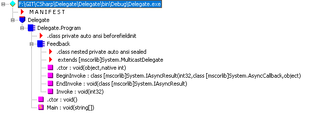
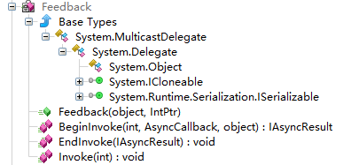

* C# 代码  


* IL 代码   


* 代码分析
  * C# 代码
    ``` CSHARP
    class Program
    {

        delegate void Feedback(int value);


        Feedback feedback;

        static void Main(string[] args)
        {
            Program program = new Program();
            program.feedback += OnFeedbackStatic;

            program.feedback += program.OnFeedback;

            program.feedback(1);
            System.Console.ReadKey();
        }

        private static void OnFeedbackStatic(int value)
        {
            Console.WriteLine("OnFeedbackStatic");
        }

        private void OnFeedback(int value)
        {
            Console.WriteLine("OnFeedback");
        }
    }
    ```
    * IL 代码
    ```CSHARP
    .method private hidebysig static void  Main(string[] args) cil managed
    {
    .entrypoint
    // Code size       95 (0x5f)
    .maxstack  4
    .locals init ([0] class Delegate.Program program)
    IL_0000:  nop
    IL_0001:  newobj     instance void Delegate.Program::.ctor()
    IL_0006:  stloc.0
    IL_0007:  ldloc.0
    IL_0008:  dup
    IL_0009:  ldfld      class Delegate.Program/Feedback Delegate.Program::feedback
    IL_000e:  ldnull
    IL_000f:  ldftn      void Delegate.Program::OnFeedbackStatic(int32)
    IL_0015:  newobj     instance void Delegate.Program/Feedback::.ctor(object,
                                                                        native int)
    IL_001a:  call       class [mscorlib]System.Delegate [mscorlib]System.Delegate::Combine(class [mscorlib]System.Delegate,
                                                                                            class [mscorlib]System.Delegate)
    IL_001f:  castclass  Delegate.Program/Feedback
    IL_0024:  stfld      class Delegate.Program/Feedback Delegate.Program::feedback
    IL_0029:  ldloc.0
    IL_002a:  dup
    IL_002b:  ldfld      class Delegate.Program/Feedback Delegate.Program::feedback
    IL_0030:  ldloc.0
    IL_0031:  ldftn      instance void Delegate.Program::OnFeedback(int32)
    IL_0037:  newobj     instance void Delegate.Program/Feedback::.ctor(object,
                                                                        native int)
    IL_003c:  call       class [mscorlib]System.Delegate [mscorlib]System.Delegate::Combine(class [mscorlib]System.Delegate,
                                                                                            class [mscorlib]System.Delegate)
    IL_0041:  castclass  Delegate.Program/Feedback
    IL_0046:  stfld      class Delegate.Program/Feedback Delegate.Program::feedback
    IL_004b:  ldloc.0
    IL_004c:  ldfld      class Delegate.Program/Feedback Delegate.Program::feedback
    IL_0051:  ldc.i4.1
    IL_0052:  callvirt   instance void Delegate.Program/Feedback::Invoke(int32)
    IL_0057:  nop
    IL_0058:  call       valuetype [mscorlib]System.ConsoleKeyInfo [mscorlib]System.Console::ReadKey()
    IL_005d:  pop
    IL_005e:  ret
    } // end of method Program::Main
    ```

* delegate 结构
      
1. Delegate 只当个委托对象，包含调用对象、调用方法信息。
2. MulticastDelegate 是对 Delegate 的封装，扩展了调用链相关的增加、删除。每次改变都是创建新的委托对象。
3. 委托链中可存在多次同一个调用，当删除时，只删除最后加入的那个。
4. 委托判断相等，是通过对象和调用方法判断。
5. 若委托有返回参数，最后一个返回值有效。