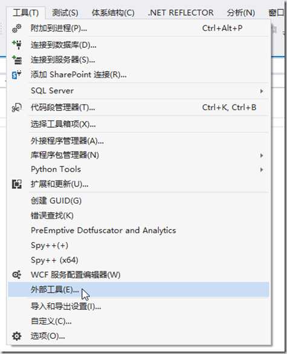
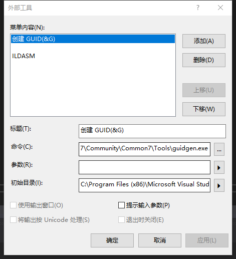
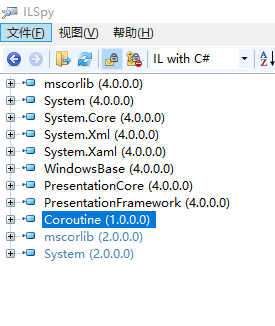
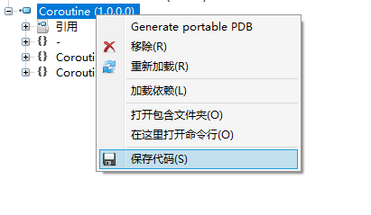

<!-- TOC -->

- [[1 MSIL 指令笔记](Instruction/README.md)](#1-msil-指令笔记instructionreadmemd)
- [2 ILDasm 使用](#2-ildasm-使用)
    - [2.1 ILDasm 导入 VS](#21-ildasm-导入-vs)
- [3 ILSpy 使用](#3-ilspy-使用)
- [4 程序集深入了解](#4-程序集深入了解)
- [参考文章](#参考文章)

<!-- /TOC -->

# [1 MSIL 指令笔记](Instruction/README.md)

| OpCodes  | Desc |
| ------------- | ------------- |
| Add  | 弹出 evaluation stack 上的数，相加后将结果压入 evaluation stack  |

# 2 ILDasm 使用

> 微软的IL反编译实用程序——Ildasm.exe，可以对可执行文件（ex，经典的控制台Hello World 的 exe 可执行文件）抽取出 IL 代码，并且给出命名空间以及类的视图。在讲述如何反编译之前，有必要从虚拟CPU的角度来看CLR，这样有助于先从正面了解代码执行过程。

## 2.1 ILDasm 导入 VS
>工具----》外部工具-----》添加   
标题我一般取为 ILDASM，命令那一栏是要选择 ILDASM 的路径   
一般情况路径：C:\Program Files (x86)\Microsoft Visual Studio\2017\Community\Common7\Tools\guidgen.exe

 

# 3 ILSpy 使用
>早期.Net平台下的反编译软件一般用reflector，但自从其商业化后就没有使用了，现在主要用ILSpy查看dll的源码，其开源、免费的特点很快就流行开来，功能和性能丝毫不逊于reflector。 [ILSpy 下载地址](https://github.com/icsharpcode/ILSpy/releases)

* 打开软件

* 导出代码

# 4 程序集深入了解

# 参考文章  
- [在 visual studio 中添加 ILDASM 工具](https://www.cnblogs.com/daimajun/p/6849596.html)  
- [初识Ildasm.exe——IL反编译的实用工具](https://www.cnblogs.com/yangmingming/archive/2010/02/03/1662307.html)  
- [ILSpy 下载地址](https://github.com/icsharpcode/ILSpy/releases)
- [ILSpy 工具使用](https://www.cnblogs.com/kedarui/p/3706044.html)  
- [使用ILSpy软件反编译.Net应用程序的方法及注意事项](https://www.cnblogs.com/GmrBrian/p/7858543.html)