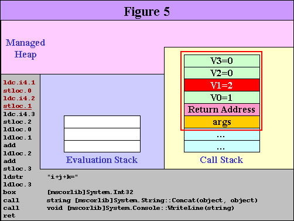
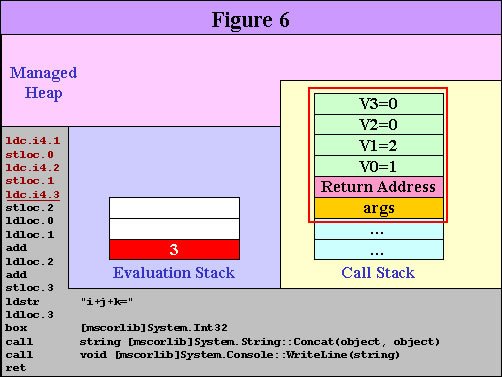
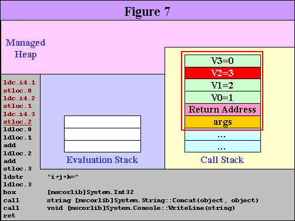
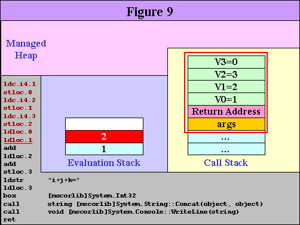

<!-- TOC -->

- [[1 MSIL 指令笔记]](#1-msil-%e6%8c%87%e4%bb%a4%e7%ac%94%e8%ae%b0)
- [2 ILDasm 使用](#2-ildasm-%e4%bd%bf%e7%94%a8)
  - [2.1 ILDasm 导入 VS](#21-ildasm-%e5%af%bc%e5%85%a5-vs)
- [3 ILSpy 使用](#3-ilspy-%e4%bd%bf%e7%94%a8)
- [4 程序集深入了解](#4-%e7%a8%8b%e5%ba%8f%e9%9b%86%e6%b7%b1%e5%85%a5%e4%ba%86%e8%a7%a3)
  - [4.1 C#代码编译过程](#41-c%e4%bb%a3%e7%a0%81%e7%bc%96%e8%af%91%e8%bf%87%e7%a8%8b)
  - [4.2 代码分析](#42-%e4%bb%a3%e7%a0%81%e5%88%86%e6%9e%90)
    - [4.2.1 IL 代码查看](#421-il-%e4%bb%a3%e7%a0%81%e6%9f%a5%e7%9c%8b)
    - [4.2.2 IL 代码分析](#422-il-%e4%bb%a3%e7%a0%81%e5%88%86%e6%9e%90)
- [参考文章](#%e5%8f%82%e8%80%83%e6%96%87%e7%ab%a0)

<!-- /TOC -->

# [1 MSIL 指令笔记]
[MSIL 指令说明](Instruction/README.md),主要包含指令名，说明，内存操作顺序。


# 2 ILDasm 使用

> 微软的IL反编译实用程序——Ildasm.exe，可以对可执行文件（ex，经典的控制台Hello World 的 exe 可执行文件）抽取出 IL 代码，并且给出命名空间以及类的视图。在讲述如何反编译之前，有必要从虚拟CPU的角度来看CLR，这样有助于先从正面了解代码执行过程。

## 2.1 ILDasm 导入 VS
>工具----》外部工具-----》添加   
标题我一般取为 ILDASM，命令那一栏是要选择 ILDASM 的路径   
一般情况路径：C:\Program Files (x86)\Microsoft Visual Studio\2017\Community\Common7\Tools\guidgen.exe

 

# 3 ILSpy 使用
>早期.Net平台下的反编译软件一般用reflector，但自从其商业化后就没有使用了，现在主要用ILSpy查看dll的源码，其开源、免费的特点很快就流行开来，功能和性能丝毫不逊于reflector。 [ILSpy 下载地址](https://github.com/icsharpcode/ILSpy/releases)

* 打开软件

* 导出代码


# 4 程序集深入了解
## 4.1 C#代码编译过程

    C#源代码通过LC转为IL代码，IL主要包含一些元数据和中间语言指令；  
    JIT编译器把IL代码转为机器识别的机器代码。如下图:


    语言编译器：无论是VB code还是C# code都会被Language Compiler转换为MSIL
    MSIL的作用：MSIL包含一些元数据和中间语言指令
    JIT编译器的作用：根据系统环境将MSIL中间语言指令转换为机器码
    
    为什么ASP.NET网站第一次运行时会较慢，而后面的执行速度则会相对快很多？
    当你第一次运行.NET开发的站点时，CLR会将MSIL通过JIT进行编译，最终转换为执行速度非常快的Native Code。这可以解释。

    * 为什么要了解IL代码？ *
    如果想学好.NET，IL是必须的基础，IL代码是.NET运行的基础，当我们对运行结果有异议的时候，可以通过IL代码透过表面看本质；  
    IL也是更好理解、认识CLR的基础；  
    大量的实例分析是以IL为基础的，所以了解IL，是读懂他人代码的必备基础，同时自己也可以获得潜移默化的提高；

## 4.2 代码分析

```C#
class Program
{
    static void Main(string[] args)
    {
        int i = 1;
        int j = 2;
        int k = 3;
        int answer = i + j + k;
        Console.WriteLine("i+j+k=" + answer);
        Console.ReadKey();
    }
}
```
### 4.2.1 IL 代码查看
* ILDasm 图标意义  

* ILDasm 分析  

* ILDasm 查看代码  


### 4.2.2 IL 代码分析

    **.NET CLR** 是基于栈的虚拟机器，指令集（Instruction Set）都是采用堆栈运算的方式：执行时的数据都是先放在堆栈中，再进行运算。

程序执行时，内存类型分别有三种：  
* **Managed Heap**  
    托管堆内存，主要用于动态分配，由 **Garbage Collector** 自动管理，整个程序共用一个。
* **Call Stack**  
    **.NET CLR** 自动管理的栈，每个 **Thread** 独立拥有，主要用于方法的调用，没调用一个函数，将增加一个 **Record Frame**，调用完成后被丢掉。**Record Frame**内记录：method 参数（Parameter）、返回位址（Return Address）、局部变量（Local Variable）。局部变量使用 0, 1, 2...来区别
* **Evaluation Stack**  
    **.NET CLR** 自动管理的栈，tu每个 **Thread** 独立拥有

1. 在进入 Main() 之后，尚未执行任何指令之前，内存的状态如图所示：  

2. 接着执行第一道指令 ldc.i4.1。此指令的意思是：在 Evaluation Stack 置入一个 4 byte 的常数，其值为 1。执行完此道指令之后，内存的状态如图所示：  

3. 接着执行第二道指令 stloc.0。此指令的意思是：从 Evaluation Stack 取出一个值，放到第 0 号变量（V0）中。这里的第 0 号变量其实就是代码中的 i。执行完此道指令之后，内存的状态如图所示：

4. 后面的第三道指令和第五道指令雷同于第一道指令，且第四道指令和第六道指令雷同于第二道指令。提醒大家第 1 号变量（V1）其实就是代码中的 j，且第 2 号变量（V2）其实就是代码中的 k。执行完 3-6 指令之后，内存的状态如图所示：
  
  
  
  
5. 接着要执行第七道指令 ldloc.0 以及第八道指令 ldloc.1：分別将 V0（也就是 i）和 V1（也就是 j）的值放到 Evaluation Stack，这是相加前的准备动作。图 8 与图 9 分別是执行完第七、第八道指令之后，内存的状态如图所示：  
  
  
6. 接着要执行第九道指令 add。此指令的意思是：从 Evaluation Stack 取出两个值（也就是 i 和 j），相加之后将结果放回 Evaluation Stack 中。执行完此道指令之后，内存的状态如图 10 所示：  
  
7. 接着要执行第十道指令 ldloc.2。此指令的意思是：分別将 V2（也就是 k）的值放到 Evaluation Stack，这是相加前的準备動作。执行完此道指令之后，内存的状态如图 11 所示：  
  
8. 接着要执行第十一道指令 add。从 Evaluation Stack 取出两个值，相加之后将结果放回 Evaluation Stack 中，此为 i+j+k 的值。执行完此道指令之后，内存的状态如图 12 所示：
  
9. 接着要执行第十二道指令 stloc.3。从 Evaluation Stack 取出一个值，放到第 3 号变量（V3）中。这里的第3号变量其实就是代码中的 answer。执行完此道指令之后，内存的状态如图 13 所示：  
  
10. 接着要执行第十三道指令 ldstr "i+j+k="。此指令的意思是：将 "i+j+k=" 的 Reference 放进 Evaluation Stack。执行完此道指令之后，内存的状态如图 14 所示：  
  
11. 接着要执行第十四道指令 ldloc.3。将 V3 的值放进 Evaluation Stack。执行完此道指令之后，内存的状态如图 15 所示：  
  
12. 接着要执行第十五道指令 box [mscorlib]System.Int32。此指令的意思是：从 Evaluation Stack 中取出一个值，将此 Value Type 包装（box）成为 Reference Type。执行完此道指令之后，内存的状态如图 16 所示：  
  
13. 接着要执行第十六道指令 call string [mscorlib] System.String::Concat(object, object)。此指令的意思是：从 Evaluation Stack 中取出两个值，此二值皆为 Reference Type，下面的值当作第一个参数，上面的值当作第二个参数，调用 mscorlib.dll 所提供的 System.String.Concat() method 来将此二参数进行字串接合（String Concatenation），将接合出来的新字串放在 Managed Heap，将其 Reference 放进 Evaluation Stack。值得注意的是：由于 System.String.Concat() 是 static method，所以此处使用的指令是 call，而非 callvirt（调用虚拟）。执行完此道指令之后，内存的状态如图 17 所示：  
  
    请注意：此时 Managed Heap 中的 Int32(6) 以及 String("i+j+k=") 已经不再被引用，所以变成垃圾，等待 GC 的回收。  

14. 接着要执行第十七道指令 call void [mscorlib] System.Console::WriteLine(string)。此指令的意思是：从 Evaluation Stack 中取出一个值，此值为 Reference Type，将此值当作参数，调用 mscorlib.dll 所提供的 System.Console.WriteLine() method 来将此字符串显示在 Console 窗口上。System.Console.WriteLine() 也是 static method。执行完此道指令之后，内存的状态如图 18 所示：  
  
15. 接着要执行第十八道指令 ret。此指令的意思是：结束此次调用（也就是 Main 的调用）。此时会检查 Evaluation Stack 內剩下的内容，由于 Main() 宣告不需要传出值（void），所以 Evaluation Stack 內必须是空的，本范例符合这样的情況，所以此时可以损利结束此次调用。而 Main 的调用一结束，程序也隨之结束。执行完此道指令之后（且在程序结束前），内存的状态如图 19 所示：  
  

透过此范例，读者应该可以对于 IL 有最基本的认识。对 IL 感兴趣的读者应该自行阅读 Serge Lidin 所著的《Inside Microsoft .NET IL Assembler》（Microsoft Press 出版）。我认为：熟知 IL 每道指令的作用，是 .NET 程序员必备的知识。.NET 程序员可以不会用 IL Assembly 写程序，但是至少要看得懂 ILDASM 反编译出来的 IL 代码。

# 参考文章  
- [在 visual studio 中添加 ILDASM 工具](https://www.cnblogs.com/daimajun/p/6849596.html)  
- [初识Ildasm.exe——IL反编译的实用工具](https://www.cnblogs.com/yangmingming/archive/2010/02/03/1662307.html)  
- [ILSpy 下载地址](https://github.com/icsharpcode/ILSpy/releases)
- [ILSpy 工具使用](https://www.cnblogs.com/kedarui/p/3706044.html)  
- [使用ILSpy软件反编译.Net应用程序的方法及注意事项](https://www.cnblogs.com/GmrBrian/p/7858543.html)
- [详解.NET IL代码](https://www.cnblogs.com/yinrq/p/5486103.html)
- [.NET中間語言（IL）](https://docs.microsoft.com/zh-tw/previous-versions/dd229210%28v%3dmsdn.10%29)